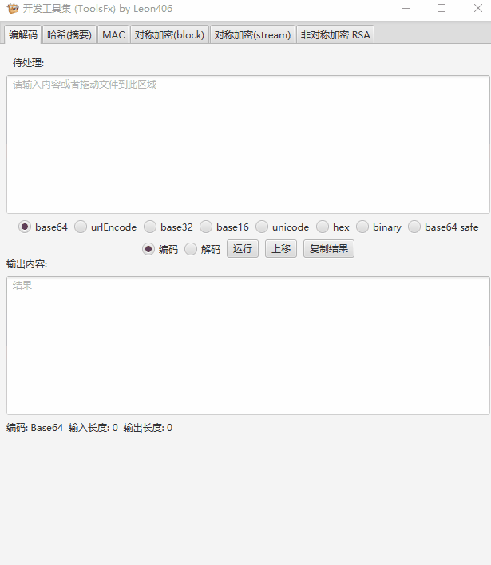
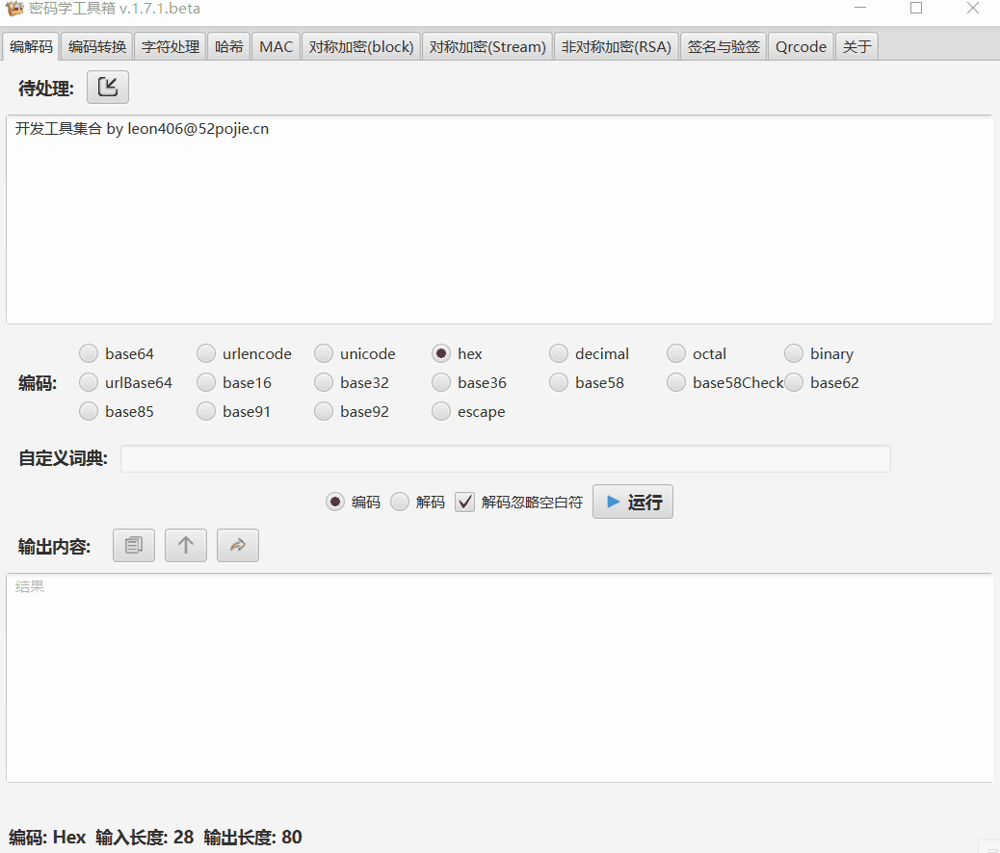
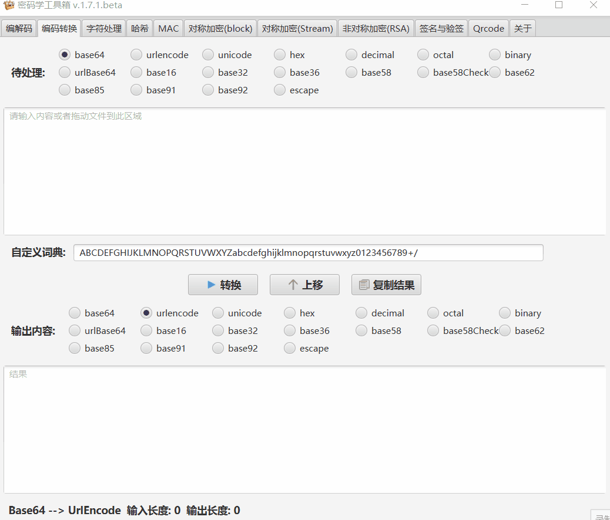
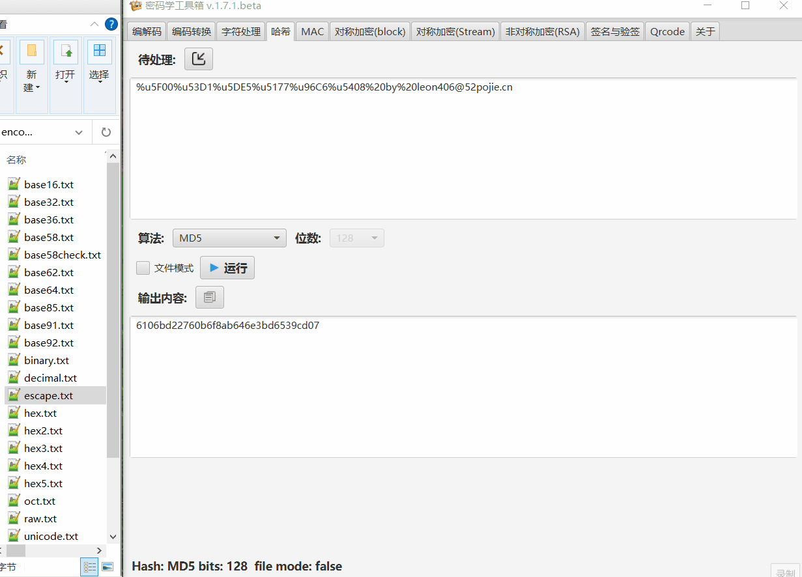
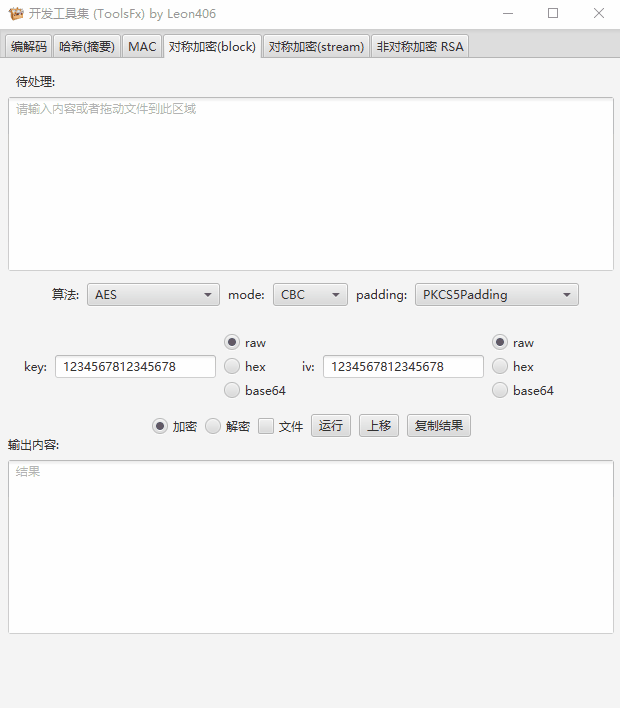
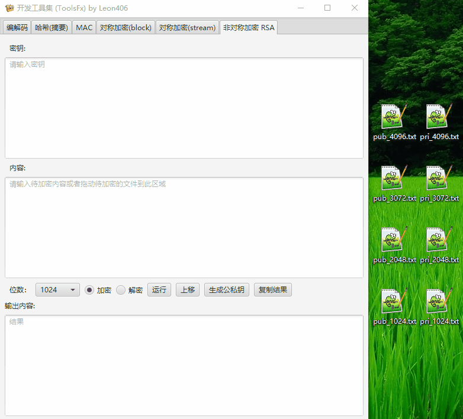
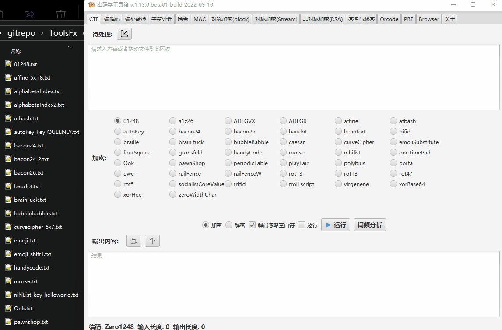
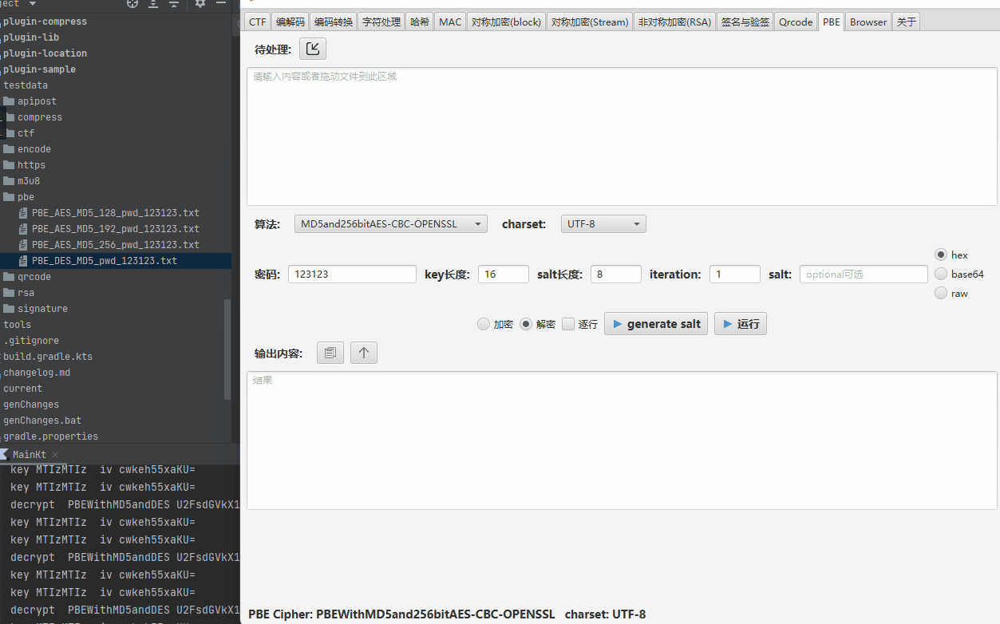

<div align=center></div>

<h1 align="center">ToolsFx</h1>
<p align="center">
<a href="https://github.com/Leon406/ToolsFx/releases/latest"></a>
<a href="https://github.com/Leon406/ToolsFx/actions/workflows/app-test.yml"></a>
<a href="https://github.com/Leon406/ToolsFx/actions/workflows/detekt.yml"></a>

<a href="changelog.md"></a>


<a target="_blank" href="https://qm.qq.com/cgi-bin/qm/qr?k=RfiFeARrf_XDHsT0_TzwbWPIpxDTCx4Z&jump_from=webapi&authKey=zDsFRjKKhpfstcAP/XouVrrFO7m+vfjU3S7j5ZuXo1SnxTpPKIQyLX2da+bowY1P"></a>
<a href="https://gitter.im/ToolsFx/community?utm_source=badge&utm_medium=badge&utm_campaign=pr-badge"></a>
</p>
<p align="center">
<a href="README.md">English</a>|<a href="README-zh.md">中文</a>
</p>
<p align="center">
 
</p>


------

## <span id="top">前言</span>

**为什么开发这个工具?**

- 每次加解密需要找在线工具进行处理,效率低
- 在线工具支持的功能不全或者某些处理结果不对 (如查错网AES CFB/OFB 加密错误)
- 大部分工具不支持文件加密
- 第三方PC端工具功能不全,体验不好,不支持跨平台 (如PYG密码工具箱)

## 主要功能

### 编解码  [wiki](https://github.com/Leon406/ToolsFx/wiki/%E7%BC%96%E8%A7%A3%E7%A0%81(Encoding))

- [x] base64
- [x] urlBase64
- [x] base16/32/36/45/58/62/85/91/92/100
- [x] base58check
- [x] UrlEncode
- [x] Unicode
- [x] js hex(\x61)/js octal(\140)
- [x] binary/octal/decimal/hex
- [x] base系列自定义字典
- [x] puny code
- [x] quote printable
- [x] uuEncode
- [x] xxEncode
- [x] escape/escapeAll
- [x] 自动解码(crack)




**字符处理(以分割为例)**



### 编码互转功能 (非原始字符)

- [x] 编解码功能相互转换



### 数据摘要(哈希)

支持文件, 支持超大文件,8G文件测试ok

- [x] md系列
- [x] sha1
- [x] sha2系列
- [x] sha3
- [x] SM3
- [x] RIPEMD
- [x] whirpool
- [x] Tiger
- [x] 其他 BouncyCastle支持的算法
- [x] 支持字典爆破,可配置字典



### MAC

#### HMAC

- [x] md系列
- [x] sha1
- [x] sha2系列
- [x] sha3
- [x] SM3
- [x] RIPEMD
- [x] whirpool
- [x] Tiger
- [x] 其他 BouncyCastle支持的算法

#### CMAC

- [x] AESCMAC
- [x] BLOWFISHCMAC
- [x] DESCMAC
- [x] DESEDECMAC
- [x] SEED-CMAC
- [x] Shacal-2CMAC
- [x] SM4-CMAC
- [x] Threefish-256CMAC / Threefish-512CMAC / Threefish-1024CMAC

#### GMAC

#### POLY1305

- [x] POLY1305
- [x] POLY1305-AES
- [x] POLY1305-ARIA
- [x] POLY1305-CAMELLIA
- [x] POLY1305-CAST6
- [x] POLY1305-NOEKEON
- [x] POLY1305-RC6
- [x] POLY1305-SEED
- [x] POLY1305-SERPENT
- [x] POLY1305-SM4
- [x] POLY1305-Twofish

### 分组对称加密 (block cipher)

#### 加密算法

- [x] DES/3DES
- [x] AES
- [x] SM4
- [x] Blowfish
- [x] Twofish
- [x] RC2
- [x] 其他 BouncyCastle支持的算法

<details>
<summary>支持mode</summary>
<ul>
<li>ECB</li>
<li>CBC</li>
<li>OFB(n)</li>
<li>CFB(n)</li>
<li>SIC (also known as CTR)</li>
<li>CTS (equivalent to CBC/WithCTS)</li>
<li>CCM (AEAD)</li>
<li>EAX (AEAD)</li>
<li>GCM (AEAD)</li>
<li>OCB (AEAD)</li>
</ul>
</details>

<details>
<summary>支持padding scheme</summary>
<ul>
<li>No padding</li>
<li>PKCS5/7</li>
<li>ISO10126/ISO10126-2</li>
<li>ISO7816-4/ISO9797-1</li>
<li>X9.23/X923</li>
<li>TBC</li>
<li>ZeroByte</li>
<li>withCTS (if used with ECB mode)</li>
</ul>
</details>



### 流式对称加密 (stream cipher)

- [x] RC4 (aka. ARC4)
- [x] HC128/HC256
- [x] ChaCha/ChaCha20/ChaCha20-Poly1305
- [x] Salsa20
- [x] XSalsa20
- [x] VMPC
- [x] Grainv1
- [x] Grain128
- [x] Zuc128
- [x] 其他 BouncyCastle支持的算法

### 非对称加密 RSA

- [x]  密钥支持pkcs1 /pkcs8
- [x]  支持512/1024/2048/3072/4096位
- [x]  支持长度大于RSA位数
- [x]  支持公钥加密私钥解密,私钥加密公钥解密
- [x]  支持openssl pkcs1/pkcs8 私钥格式
- [x]  支持证书cer文件加解密
- [x]  支持pem和pk8格式文件 :new:

**note:** openssl用公私钥对加解密,生成私钥为pkcs8编码



### 数字签名校验

- [x] RSA系列
- [x] DSA
- [x] ECDSA
- [x] EC
- [x] EdDSA(ED448/ED25192)
- [x] SM2
- [x] 其他 BouncyCastle支持的算法

### CTF (古典密码及其他 )  [wiki](https://github.com/Leon406/ToolsFx/wiki/CTF)

- [x] 凯撒
- [x] rot5/rot13/rot18/rot47
- [x] 仿射
- [x] virgenene
- [x] atbash
- [x] 摩尔斯密码(morse)
- [x] qwe键盘加密
- [x] polybius
- [x] 培根24/培根26
- [x] 一次性密码
- [x] 社会主义核心价值观
- [x] ADFGX/ADFGVX
- [x] Auto Key
- [x] 栅栏密码 / 栅栏密码 w
- [x] playfair
- [x] brainfuck/troll/ook
- [x] 盲文 (braille)
- [x] 字母位置
- [x] 01248(云影)
- [x] BubbleBabble
- [x] 元素周期表
- [x] 当铺密码(PawnShop Cipher)
- [x] 曲路密码(CurveCipher)
- [x] Handy code
- [x] 博福特密码(Beaufort)
- [x] Porta 密码
- [x] Bifid/Trifid/四方密码 (FourSquare Cipher)
- [x] Gronsfeld密码
- [x] 格雷码(Gray code)
- [x] 与佛论禅/与佛论禅(加密版)
- [x] 希尔密码
- [x] 新约佛论禅/兽音/熊曰(需联网)
- [x] rabbit
- [x] aaencode/jjencode
- [x] RSA crack (nec,pqec)
- [x] 其他




### PBE



### misc模块

- 时间戳转换
- 日志转时间戳
- 生成uuid （支持多组）
- 端口扫描
- 局域网ip扫描
- ping
- tcping

### 其他功能

- [x] 二维码功能/OCR
- [x] 字符处理
- [x] 大数运算
- [x] 椭圆加密曲线计算
- [ ] 待定

### 特性

- [x] 支持文件拖入
- [x] 对称加密key, iv 支持base64 ,hex
- [x] 哈希/对称加密支持多个文件加密解密
- [x] i18n
- [x] CTF相关功能
- [x] PBE
- [x] 可配置模块,支持第三方网址

bouncy castle文档 https://www.bouncycastle.org/specifications.html


## 下载地址

[GitHub](https://github.com/Leon406/ToolsFx/releases)

[码云镜像](https://gitee.com/LeonShih/ToolsFx)

下载加速 https://leon.lanzoui.com/b0d9av2kb 提取码：52pj
插件下载 https://leon.lanzoub.com/b0d9w4cof 提取码：ax63

#### 开发测试时间较短,难免会有bug,欢迎提需求,issue和PR

## 版本选择

- 未安装JDK/JRE (普通用户,无需配置,直接使用,文件较大)
    - 64位 Windows        -----	withjre-win-x64(最新LTS 版本)
    - 32/64位 Windows  -----	jdk8-withjre-windows-x86 (JRE 8,不知道就选这个)

- 已安装JDK/JRE (开发人员,需配置,文件小)
  
    - JDK8(Oracle 官方)   -----	jdk8-all-platform
    - JDK11+                     -----	jdk17-no-jfx-all-platform + 配置javafx环境变量
    
- beta版 (尝鲜用户,可以成功运行上面任意一个文件后,jar文件)

   需要复制到lib目录,同时删除ToolsFx-xxx.jar(旧文件名)和 app-xxx.jar

- [github action nightly版本(同beta版本,实时构建)](https://github.com/Leon406/ToolsFx/actions/workflows/app-test.yml)

   [nightly.link](https://nightly.link/Leon406/ToolsFx/workflows/app-test/dev/artifact.zip)


## 如何运行

- Linux/Mac OSX系统双击运行 根目录下 ToolsFx
- Windows 系统双击运行ToolsFx.bat或者 vbs文件(去除黑窗)

## 如何配置

启动时,默认会生成配置文件ToolsFx.properties, 修改对应的值即可

| key                     | value                                     |
| ----------------------- | ----------------------------------------- |
| isEnableClassical       | 古典密码学启用开关,默认false              |
| isEnablePBE             | PBE启用开关,默认false                     |
| isEnableSignature       | 签名启用开关,默认true                     |
| isEnableMac             | MAC启用开关,默认true                      |
| isEnableSymmetricStream | 对称加密(stream)启用开关,默认true         |
| isEnableQrcode          | 二维码启用开关,默认true                   |
| isEnableInternalWebview | 内置浏览器启用开关,默认false              |
| offlineMode             | 离线模式,不显示联网的功能,默认false       |
| uiScale                 | 页面缩放比例,默认-1 不缩放                |
| extUrls                 | 内置浏览器默认收藏链接,多个用英文逗号分隔 |

## [插件](README-plugin-zh.md)

- ApiPost 接口调试工具

## CHANGE LOG

见 [changelog.md](changelog.md)

## CREDIT

[bouncy castle](https://github.com/bcgit/bc-java)

[tornadofx](https://github.com/edvin/tornadofx)

[JetBrains](https://jb.gg/OpenSourceSupport)

[badge maker](https://shields.io/)

## DONATE

[赞赏作者](https://afdian.net/a/leon406)

## Stargazers over time

[](https://starchart.cc/Leon406/ToolsFx)

## LICENSE

```
ISC License

Copyright (c) 2021, Leon406

Permission to use, copy, modify, and/or distribute this software for any
purpose with or without fee is hereby granted, provided that the above
copyright notice and this permission notice appear in all copies.

THE SOFTWARE IS PROVIDED "AS IS" AND THE AUTHOR DISCLAIMS ALL WARRANTIES
WITH REGARD TO THIS SOFTWARE INCLUDING ALL IMPLIED WARRANTIES OF
MERCHANTABILITY AND FITNESS. IN NO EVENT SHALL THE AUTHOR BE LIABLE FOR
ANY SPECIAL, DIRECT, INDIRECT, OR CONSEQUENTIAL DAMAGES OR ANY DAMAGES
WHATSOEVER RESULTING FROM LOSS OF USE, DATA OR PROFITS, WHETHER IN AN
ACTION OF CONTRACT, NEGLIGENCE OR OTHER TORTIOUS ACTION, ARISING OUT OF
OR IN CONNECTION WITH THE USE OR PERFORMANCE OF THIS SOFTWARE.
```

[回到顶部](#top)

