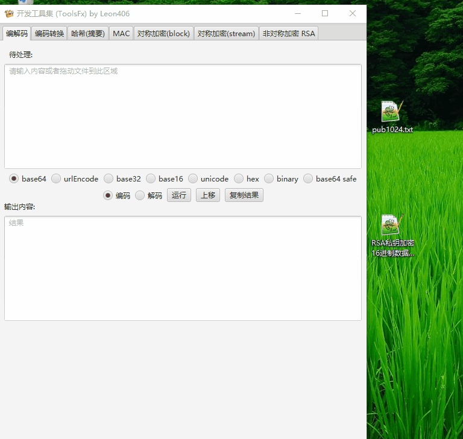

<div align=center></div>

<h1 align="center">ToolsFx</h1>
<p align="center">
<a href="https://github.com/Leon406/ToolsFx/releases/latest"></a>
<a href="https://github.com/Leon406/ToolsFx/actions/workflows/detekt-analysis.yml/badge.svg"></a>
<a href="changelog.md"></a>


</p>
<p align="center">
<a href="README.md">English</a>|<a href="README-zh.md">中文</a>
</p>
<p align="center">
 
</p>


------


## <span id="top">前言</span>

**为什么开发这个工具?**

- 每次加解密需要找在线工具进行处理,效率低
- 在线工具支持的功能不全或者某些处理结果不对 (如查错网AES CFB/OFB  加密错误)
- 大部分工具不支持文件加密
- 第三方PC端工具功能不全,体验不好,不支持跨平台 (如PYG密码工具箱)

## 主要功能

### 编解码

- [x] base64
- [x] urlBase64
- [x] base16/32/36/58/62/85/91/92/100
- [x] base58check
- [x] UrlEncode
- [x] Unicode
- [x] binary/octal/decimal/hex
- [x] base系列自定义字典


**字符处理(以分割为例)**


### 编码互转功能 (非原始字符)

- [x] 编解码功能相互转换


### 数据摘要(哈希)

支持文件, 支持超大文件,8G文件测试ok

- [x] md系列
- [x] sha1
- [x] sha2系列
- [x] sha3
- [x] SM3
- [x] RIPEMD
- [x] whirpool
- [x] Tiger
- [x] 其他 BouncyCastle支持的算法


### MAC

#### HMAC

- [x] md系列
- [x] sha1
- [x] sha2系列
- [x] sha3
- [x] SM3
- [x] RIPEMD
- [x] whirpool
- [x] Tiger
- [x] 其他 BouncyCastle支持的算法

#### CMAC

- [x] AESCMAC
- [x] BLOWFISHCMAC
- [x] DESCMAC
- [x] DESEDECMAC
- [x] SEED-CMAC
- [x] Shacal-2CMAC
- [x] SM4-CMAC
- [x] Threefish-256CMAC  / Threefish-512CMAC / Threefish-1024CMAC  

#### GMAC

#### POLY1305 

- [x] POLY1305
- [x] POLY1305-AES
- [x] POLY1305-ARIA
- [x] POLY1305-CAMELLIA
- [x] POLY1305-CAST6
- [x] POLY1305-NOEKEON
- [x] POLY1305-RC6
- [x] POLY1305-SEED
- [x] POLY1305-SERPENT
- [x] POLY1305-SM4
- [x] POLY1305-Twofish

### 分组对称加密 (block cipher)

#### 加密算法

- [x] DES/3DES
- [x] AES
- [x] SM4
- [x] Blowfish
- [x] Twofish
- [x] RC2
- [x] 其他 BouncyCastle支持的算法

#### 支持mode

- ECB
- CBC
- OFB(n)
- CFB(n)
- SIC (also known as CTR)
- CTS (equivalent to CBC/WithCTS)
- CCM (AEAD)
- EAX (AEAD)
- GCM (AEAD)
- OCB (AEAD)

#### 支持padding scheme

- No padding
- PKCS5/7
- ISO10126/ISO10126-2
- ISO7816-4/ISO9797-1
- X9.23/X923
- TBC
- ZeroByte
- withCTS (if used with ECB mode)


### 流式对称加密 (stream cipher)
- [x] RC4
- [x] HC128/HC256
- [x] ChaCha
- [x] Salsa20
- [x] XSalsa20
- [x] VMPC
- [x] Grainv1
- [x] Grain128
- [x] Zuc128
- [x] Zuc128

### 非对称加密 RSA

- [x]  密钥支持pkcs1 /pkcs8
- [x]  支持512/1024/2048/3072/4096位
- [x]  支持长度大于RSA位数
- [x]  支持公钥加密私钥解密,私钥加密公钥解密
- [x]  支持openssl pkcs1/pkcs8 私钥格式
- [x]  支持证书cer文件加解密
- [x]  支持pem和pk8格式文件 :new:

**note:** openssl用公私钥对加解密,生成私钥为pkcs8编码


公钥解密16进制数据



### 数字签名校验 

- [x] RSA系列
- [x] DSA
- [x] ECDSA
- [x] EC
- [x] EdDSA(ED448/ED25192)
- [x] SM2
- [ ] 其他

### 古典密码 (for CTF)

- [x] 凯撒
- [x] rot5/rot13/rot18/rot47
- [x] 仿射
- [x] virgenene
- [x] atbash
- [x] 摩尔斯密码
- [x] qwe键盘加密
- [x] polybius
- [x] 培根24/培根26
- [x] 一次性密码
- [x] 社会主义核心价值观
- [x] ADFGX/ADFGVX
- [x] Auto Key
- [x] 栅栏密码 /栅栏密码 w
- [x] playfair
- [x] brainfuck/ook


### 其他功能

- [x] 二维码功能
- [x] 字符处理
- [ ] 待定

### 特性

- [x] 支持文件拖入
- [x] 对称加密key, iv 支持base64 ,hex
- [x] 哈希/对称加密支持多个文件加密解密
- [x] i18n
- [x] CTF相关功能
- [x] PBE
- [x] 可配置模块,支持第三方网址

bouncycastle文档 https://www.bouncycastle.org/specifications.html

## 下载地址

 [github地址](https://github.com/Leon406/ToolsFx/releases) 

 [码云镜像](https://gitee.com/LeonShih/ToolsFx) 

下载加速 https://leon.lanzoui.com/b0d9av2kb 提取码：52pj


#### 开发测试时间较短,难免会有bug,欢迎提需求,issue和PR

## 版本选择

- 有jre环境
  - jdk8      选择jdk8的版本
  - jdk11+  选择jdk11的版本 + 同时需要配置javafx环境

- 无jre环境
  - 64位 windows系统     x64 (jre11)
  - 32/64位 windows系统  x86 (jre8,不知道就选这个)  
- beta版 (jar文件)

  需要复制到lib目录,同时删除ToolsFx.jar

## 如何运行

- Linux/Mac OX系统双击运行 bin目录下 ToolsFx 
- Windows 系统双击运行ToolsFx.bat或者 vbs文件(去除黑窗)

## 如何配置

启动时,默认会生成配置文件ToolsFx.properties, 修改对应的值即可

| key                     | value                                     |
| ----------------------- | ----------------------------------------- |
| isEnableClassical       | 古典密码学启用开关,默认false              |
| isEnablePBE             | PBE启用开关,默认false                     |
| isEnableSignature       | 签名启用开关,默认true                     |
| isEnableMac             | MAC启用开关,默认true                      |
| isEnableSymmetricStream | 对称加密(stream)启用开关,默认true         |
| isEnableQrcode          | 二维码启用开关,默认true                   |
| isEnableInternalWebview | 内置浏览器启用开关,默认false              |
| extUrls                 | 内置浏览器默认收藏链接,多个用英文逗号分隔 |


## CHANGE LOG

见 [changelog.md](changelog.md)

## CREDIT

[bouncy castle](https://github.com/bcgit/bc-java) 

[tornadofx](https://github.com/edvin/tornadofx)

## Stargazers over time

[](https://starchart.cc/Leon406/ToolsFx)

## LICENSE

```
ISC License

Copyright (c) 2021, Leon406

Permission to use, copy, modify, and/or distribute this software for any
purpose with or without fee is hereby granted, provided that the above
copyright notice and this permission notice appear in all copies.

THE SOFTWARE IS PROVIDED "AS IS" AND THE AUTHOR DISCLAIMS ALL WARRANTIES
WITH REGARD TO THIS SOFTWARE INCLUDING ALL IMPLIED WARRANTIES OF
MERCHANTABILITY AND FITNESS. IN NO EVENT SHALL THE AUTHOR BE LIABLE FOR
ANY SPECIAL, DIRECT, INDIRECT, OR CONSEQUENTIAL DAMAGES OR ANY DAMAGES
WHATSOEVER RESULTING FROM LOSS OF USE, DATA OR PROFITS, WHETHER IN AN
ACTION OF CONTRACT, NEGLIGENCE OR OTHER TORTIOUS ACTION, ARISING OUT OF
OR IN CONNECTION WITH THE USE OR PERFORMANCE OF THIS SOFTWARE.
```

[回到顶部](#top)

